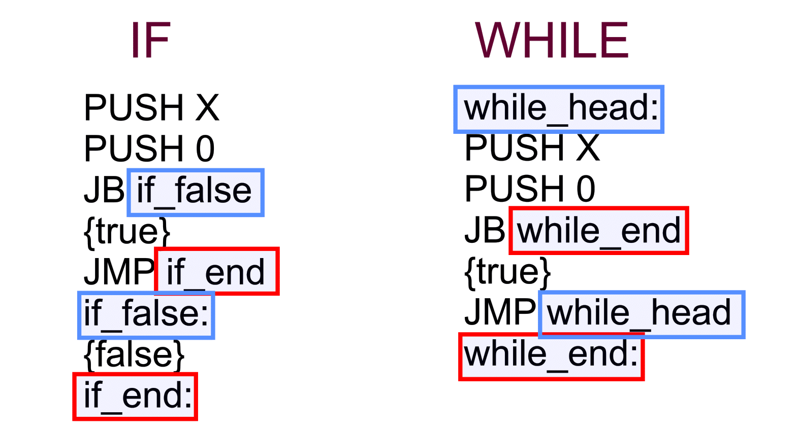
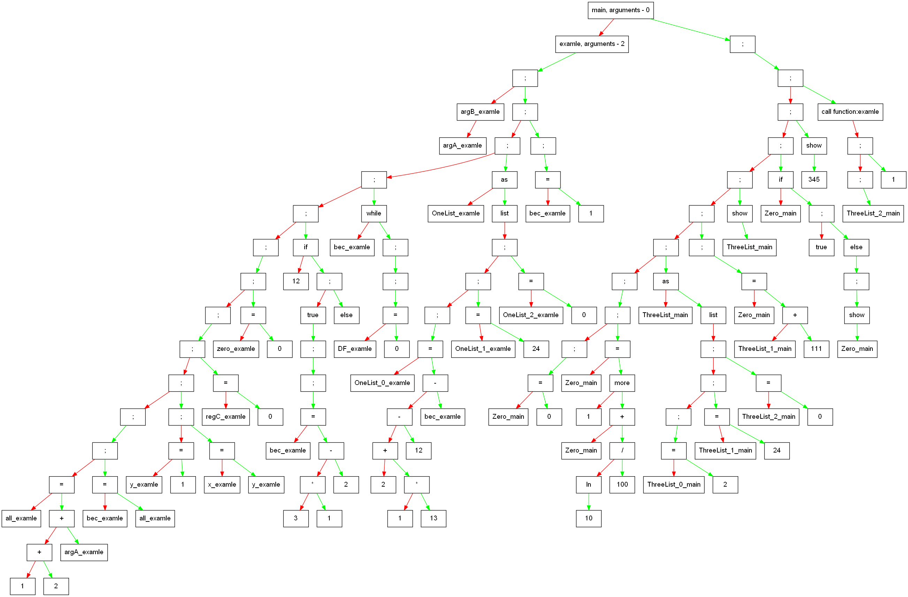
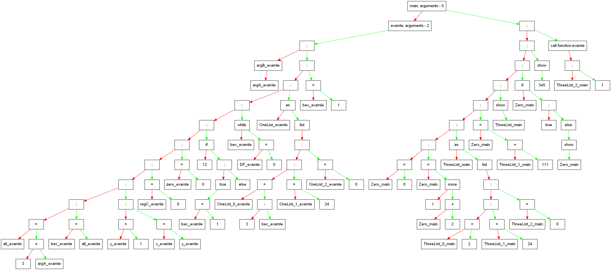
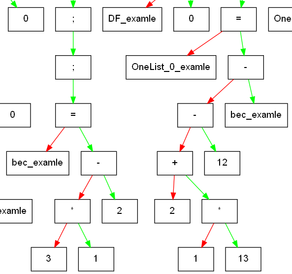
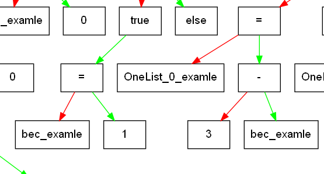

# Language
### !!!! WARNING:: The matrix is not fully implemented.
## Content:
- [Some reduction in function](#Some-reduction-in-function)	
- [Formal record of the language's rules](#Formal-record-of-the-languages-rules)	
- [Formal ASM translation rules for CPU of mine](#Formal-ASM-translation-rules-for--CPU-of-mine)
- [Some code programms](#Some-code-programms) 
- [Tree view](#Tree-view)	
- -  [Before optimization](#Before-optimization)
- -  [After optimization](#After-optimization)
- [What has been optimized](#What-has-been-optimized)
- [ASM code](#ASM-code)
## Some reduction in function
**`FuncInit`** -- Function initialization			\
**`FuncArguments`** -- Read function arguments		

**`G`** -- Grammar						\
**`VU`** -- Variables using					\
**`IF`** -- If						\
**`WHILE`** -- While						\
**`SHOW`** -- Print on the screen				\
**`MLU`** -- Matrix and list using				\
**`FU`** -- Function using					

**`LST`** -- List						

**`VI`** -- Variables initialization				\
**`NVV`** -- New value of variables				

**`COMP`** -- Compare						\
**`E`** -- Expression						\
**`T`** -- Term						\
**`D`** -- Degree						\
**`P`** -- Primary expression					\
**`MF`** -- Math functions					\
**`LI`** -- List item						\
**`V`** -- Variable						\
**`N`** -- Number					

>[Back to Content](#content)
## Formal record of the language's rules
### Expression list:
* [Users function declaration](#user-function-declaration)
* [Basic expressions](#basic-expressions)
* [List and matrix declaration](#list-and-matrix-declaration)
* [Variable declaration and new value expression](#variable-declaration-and-new-value-expression)
* [Elementary tokens](#elementary-tokens)
* [Service tokens & others](#service-tokens--others)
### User function declaration:
- - -
**`FuncInit`::=** `function` name_of_function `(` **`FuncArguments`** `)` `{` **`G`** `}`	\
{ \
&nbsp;&nbsp;&nbsp;`function` name_of_function `(` **`FuncArguments`** `)` `{` **`G`** `}`		\
}* **`END_OF_TOKENS`** 

**`FuncArguments`::=** `[a-z,A-Z]+` { _`space`_ `[a-z,A-Z]+` }*
### Basic expressions:
- - -
**`G`::=** { **`VU`** | **`IF`** | **`WHILE`** | **`SHOW`** |**`MLU`** | **`FU`**}* 

**`VU`::=** { { `@` **`VI`** `;` } | { **`NVV`** `;` } }* 

**`IF`::=** `if` `(` **`E`** `)` `true` `{` **`G`** `}` `else` `{` **`G`** `}` 	

**`WHILE`::=** `while` `(`**`E`**`)` `{` **`G`** `}`	

**`SHOW`**::= `show` [`this` **`V`**, **`N`**] `;`		

**`MLU`::=**  `let` `[a-z,A-Z]+` { `,` `[a-z,A-Z]+`}* `as int` ~~MRX~~ | **`LST`** { ~~and MLU[without let]~~}* // ~~int | dot~~ 

**`FU`::=** `name_of_function` `(` **`E`** { `,` **`E`** }*`)`
### List and matrix declaration:
- - -
~~**`MRX`::=** matrix (N * N)={N{,N}* }~~	

**`LST`::=** `list`   `(` **`N`** `)` `=` `{` **`N`** { `,` **`N`**}* `}`
(list's variable  that didn't initialized is declared zero value)
### Variable declaration and new value expression:
- - -
**`VI`::=** `[a-z,A-Z]+` { `=` **`VI`** | **`E`** { `,` **`VI`** }* }*	
(variable without equal sign is declared zero value)	

**`NVV`::=** `[a-z,A-Z]+` | **`LI`** `=` **`COMP`**

### Elementary tokens:
- - -
**`COMP`::=** **`E`**{ [`more`, `less`, `equal`, `leseq`, `greq`] **`E`** }*	

**`E`::=** **`T`**{ `[+-]` **`T`** }*	

**`T`::=** **`D`**{ `[* \ ]` **`D`** }*	

**`D`::=** **`P`**{ `[^]` **`P`** }*	

**`P`::=** `(` **`E`** `)` | **`N`** | **`LI`** | **`V`** | **`MF`**	

**`MF`::=** [`sin`, `cos`, `tg`, `ln`]`(` **`N`** `)` (when calculating, the final value is multiplied by 100 and rounded to an integer)	

**`LI`::=** `[a-z,A-Z]+` `[` **`N`** `]`

**`V`::=** `[a-z,A-Z]+`	

**`N`::=** `[0-9]+`	
### Service tokens & others:
- - -
**`END_OF_TOKENS`** -- special signal note of the end of programm	\
**`one line comments`::=** `#` some text `'new_line'`	\
**`multi line comments`::=** `##` some text `##`

>[Back to Content](#content)
## Formal ASM translation rules for  [CPU of mine](https://github.com/UniverTime/CPU)
<p align="center">
	

>[Back to Content](#content)
## Some code programms
```
function examle ( argA argB)
{
  @bec = all = (1 + 2 + argA), x = y = 1, regC;
  
  @zero;

  if ( 12 )
  true
  {
    bec = 3 * 1 - 2;
  }
  else
  {}

  while ( bec )
  { 
    @DF;
  }

  let OneList   as
     #TwoList   as 
     #ThreeList as
  int list (3) = {2 + 1 * 13 - 12 - bec, 24}

  bec = 1;
}

function main () 
{
  @Zero;
  
  Zero = 1 more Zero + ln(10) / 100;

  let ThreeList as
  int list (3) = {2, 24}

  #ThreeList[1] = ThreeList[1] + 111;

  Zero = ThreeList[1] + 111;

  show this ThreeList;

  if(Zero) true{}
  else
  {
    show this Zero;
  }

  show 345;

  examle (1, ThreeList[2])
}
```
>[Back to Content](#content)
## Tree view
> ### **Before the conversion to ASM code begins, the tree undergoes preliminary optimization (removing empty blocks, collapsing constants, and others).**
### Before optimization:

### After optimization:

## What has been optimized?
### Unoptimized
>

### Optimized
>

>[Back to Content](#content)
## ASM code
```
PUSH 0
POP [15]

PUSH [15]
PUSH 2
ADD

PUSH 1
	JA IF_END0
PUSH 0

JMP IF_FALSE0
	IF_END0:
PUSH 1

	IF_FALSE0:
POP [15]

PUSH 2
POP [16]

PUSH 24
POP [17]

PUSH 0
POP [18]

PUSH 3
POP [19]

PUSH [17]
PUSH 111
ADD

POP [15]

PUSH [19]
OUT

PUSH [15]
PUSH 0
 	JB IF_FALSE1

	JMP IF_END1
	IF_FALSE1:

PUSH [15]
OUT

	IF_END1:

PUSH 345
OUT

PUSH [18]

CALL examle
HLT


examle:

POP [2]
POP [1]

PUSH 3
PUSH [1]
ADD

POP [4]

PUSH [4]
POP [3]

PUSH 1
POP [6]

PUSH [6]
POP [5]

PUSH 0
POP [7]

PUSH 0
POP [8]

PUSH 12
PUSH 0
 	JB IF_FALSE2

PUSH 1
POP [3]

	JMP IF_END2
	IF_FALSE2:

	IF_END2:

	WHILE_HEAD3:

PUSH [3]
PUSH 0
 	JB WHILE_END3

PUSH 0
POP [9]

	JMP WHILE_HEAD3
	WHILE_END3:

PUSH 3
PUSH [3]
SUB

POP [10]

PUSH 24
POP [11]

PUSH 0
POP [12]

PUSH 3
POP [13]

PUSH 1
POP [3]

RET

```
>[Back to Content](#content)
## ©Copyright
<p align="center">
	
	
<p>

